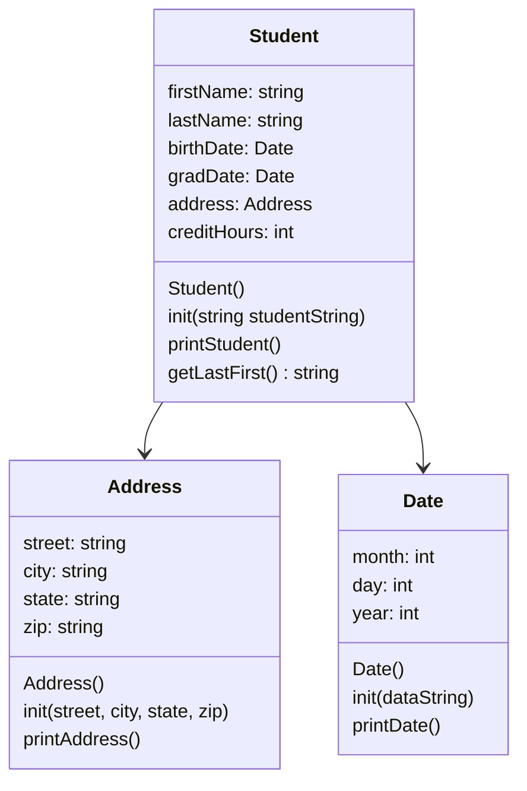

# projectSeven
Heap of Students Project

```mermaid
classDiagram

class Student{
    firstName: string
    lastName: string
    birthDate: Date
    gradDate: Date
    address: Address
    creditHours: int
    Student()
    init(string studentString)
    printStudent()
    getLastFirst() string
}

class Address{
    street: string
    city: string
    state: string
    zip: string
    Address()
    init(street, city, state, zip)
    printAddress()
}

class Date{
    month: int
    day: int
    year: int
    Date()
    init(dataString)
    printDate()
}

Student --> Address
Student --> Date
```
