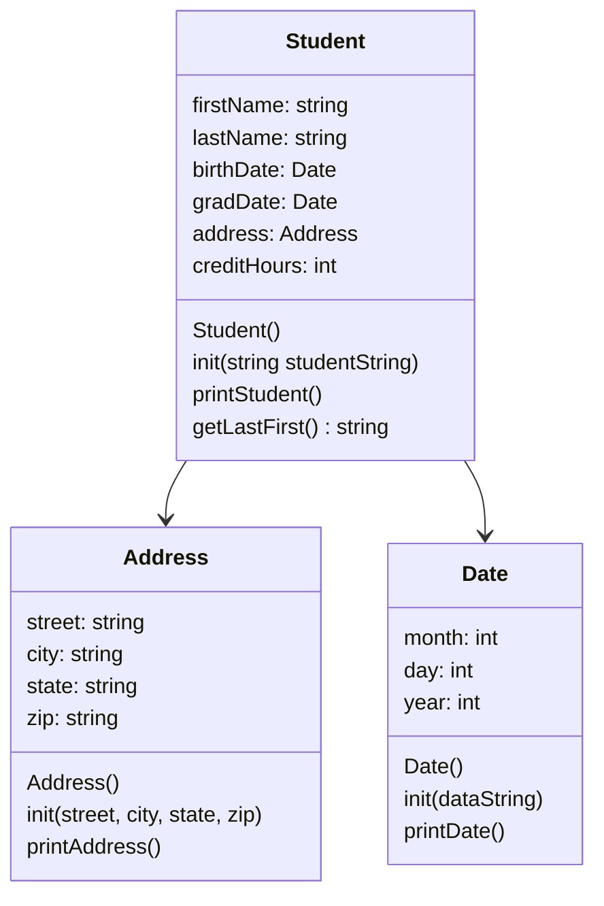

# projectSeven
Heap of Students Project

loadStudents
open students.csv
for each line:
  create instance of student on heap
  initialize student with the string line from the csv
  append to end of student vector
close students.csv

printStudents
iterate through given vector of students
for each student, run student class print function

showStudentNames
iterate throgh given vector of students
for each student, run student class  getFirstLast
print getFirstLast

findStudents
print prompt asking user for what they want to search
iterate through vector of students
for each student run getLast
use string.find(x) for each student, where string is the return value of getLast and x is the user input string
if match is found, add that student to new vector (match can be verified by checking against the std::string::npos outout value)
print this new vector
if no matches found, print a line saying "no matches found"

menu
bool while loop to keep running until quit
present user options: 0,1,2,3 for quit,print names,print data,search for student
if 0
  change bool to false
  change bool in main to false as well
if 1
  run showstudentnames function
if 2
  run printstudents function
if 3
  run findstudents
if none
  print statement alerting invalid input, loop should start again printing the options again

main
load vector from students.csv
loop with boolean until user choses exit in menu
  offer menu
  perform necesarry tasks
clear student vector
